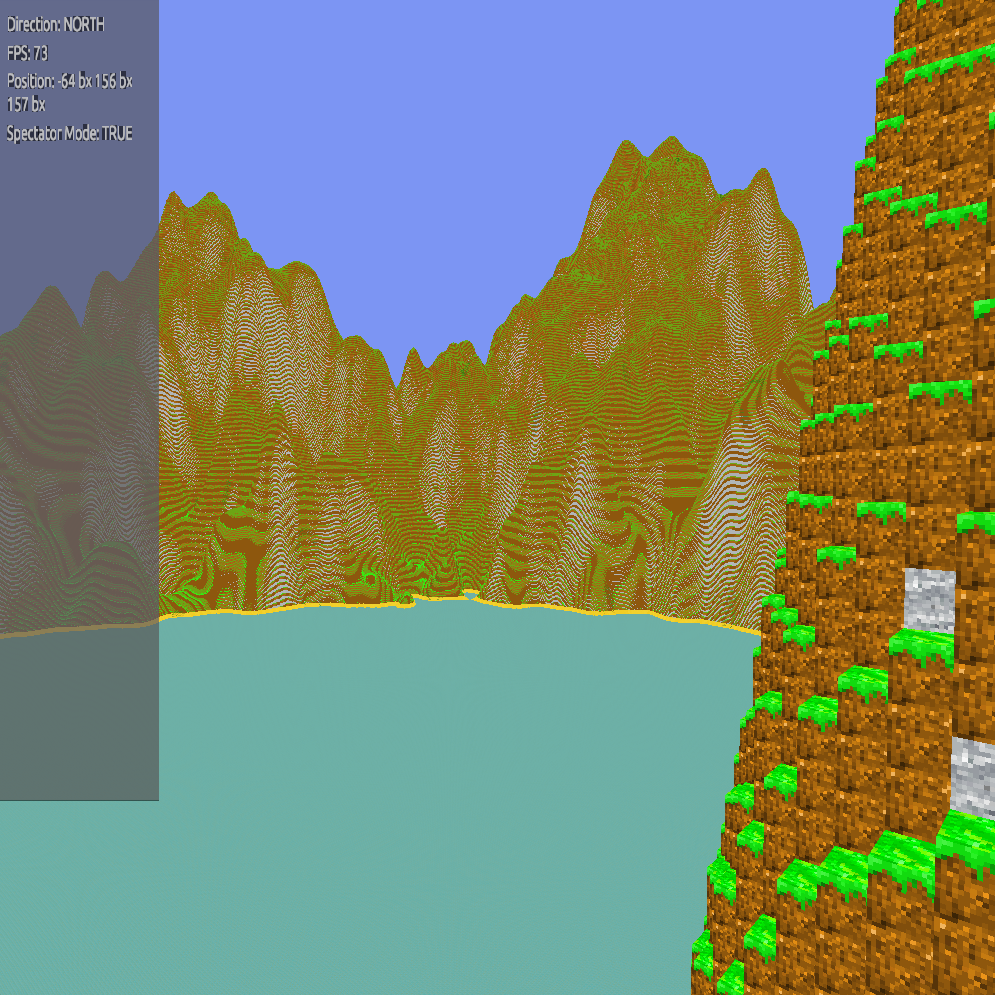
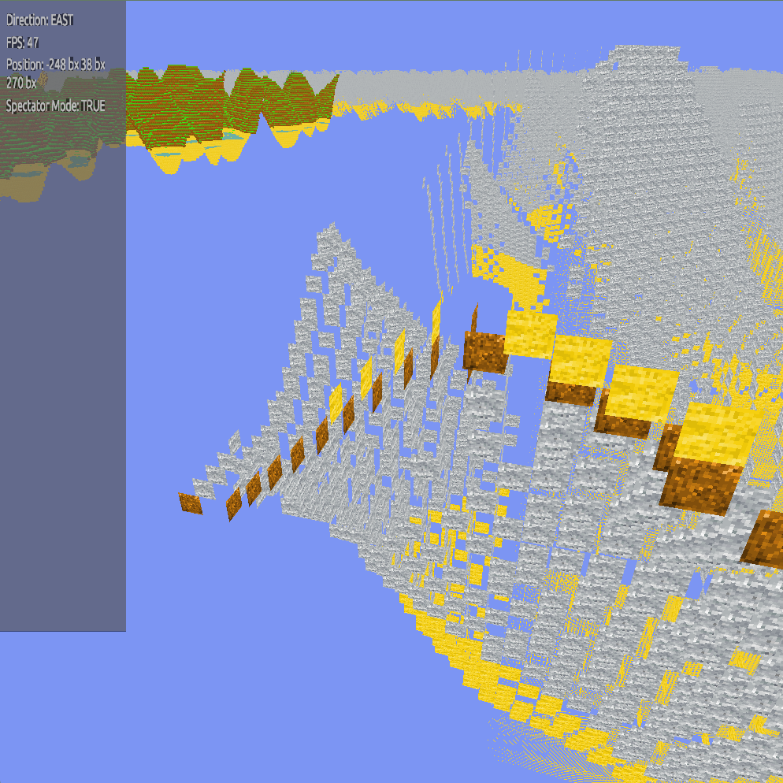

# Matrixagon 2
An experimental open-world voxel renderer using Vulkan with focus on interesting novel techniques in computer graphics, reinforcement learning, and weather simulation.

## Status
Will take a break from implementing this project for now

## Current Features (Dec '23 - Feb '24)
### "Mesh Fill List Algorithm" and Bounds Test
- A sort-of meshing algorithm that effectively reduces the memory and computation usage of mesh generation a lot
  - Only for opaque blocks like the dirt, stone, sand
- Originally, for each chunk, I generated all the block in a voxel flat array, which resulted in O(n^3) space and time complexity
  - And culling the inside blocks that are not exposed by the air, I did that block by block, hence the O(n^3) time complexity
- What this algorithm improves on is how the mesh are generated on exposde sides
  - Effectively reducing space complexity to O(n^2), while time complexity remains O(n^3) but significantly reduced
  - There are 2D grids for the x, y, and z direction, each cell represented by yz, xz, and zy position respectively
    - Each grid cells are numbers of changes from open (air) to closed (opaque) and vice versa
    - Each time the blocks are iterated in its respective direction, it tests whether the next block results in the current grid cell to change (open to close and vice versa)
  - Time complexity is significant reduced with the **height bounds test (HBT)**
    - Since the terrain is largely in two parts: above ground & underground, we can use the max/min of the base height map of the chunk and test which y-levels the chunk needs to chunk (or even skip it if it's none) 
    - This assumption can also work on the goal of making more realistic terrain for more diverse "heightmaps"
      - e.g. overhangs, caves, trees (overhanging trees/branches), etc.
- Since this algorithms *directly* stores the mesh faces into its respective direction, the aggregator in the chunk generator can easily face cull (yet to be implemented)
- Reference: [`component::terrain::mesh_util::voluminous_opaque_cubes_mesh`](src/component/terrain/mesh_util.rs)
- Errors in MFL Algorithm & HBT when first implementing it
  - Stones exposed due to error in HBT
  - Faces not rendering in certain direction due to multiple factors
    - Face generation passed with incorrect face direction parameter
    - MFL algo not testing one more block ahead, resulting in empty faces on chunk borders
  - Grass blocks are the extreme fidelity chunks, the high-fidelity chunks are absent for testing purposes, and the rest (the stones) are the mid-fidelity chunks

### Terrain Chunking
- Current terrain chunks are processed in discrete levels:
  - cx: for extreme-fidelity chunks (with the highest details)
  - hf: for high-fidelity chunks
  - mf: for mid-fidelity chunks
  - And other yet to be implemented chunk levels
- Reasoning is there will be diverse mesh optimization and culling methods that it might as well re-generate the mesh for each closer levels
  - Tried octree, but it seems too complicated to implemented for what I am going for
- Each chunk levels are generated and aggregated in different piece of code [component::terrain](src/component/terrain)

### Shaders

- [Order-independent transparency (OIT) for transparent (not translucent) textures](src/shader/chunk_transparent.frag)
  - On a separate shader program (and thus separate pipeline), the fragment shader tested whether the pixel is transparent (alpha = 0), which will reset the depth buffer to allow other transparent objects to color in
    - Effectively, the transparency now tests for *each* pixel of the texture instead of the whole mesh
  - This made rendering meshes with transparent pixels in their textures intuitive, simple, and direct
- Made the water move in a single direction
  - Testing around temporal animation using uniform buffers to change the mesh itself
- [Renderpass macro rules](mtxg2-util/src/lib.rs)
  - Made instantiating renderpass object intuitive and elegant by supplying attachment references and subpass indices via names
- [Vertex derive procedural macro](mtxg2-derive/src/lib.rs)
  - Made a separate proc macro export only crate that exposes a `#[derive(Vertex)]` that automatically generates vertex shader input for graphics pipeline during constant evaluation

## TODO: Remaining MTXG2 Core Features needing to be implemented
(Will be put on hiatus)
- Rendering optimization
  - Useful frustum culling (instead of rebuilding mesh each time the player rotates)
    - Need refactoring in how shader handles individual chunk VBO
  - Facial culling (for far away regions that rarely gets shown on all six sides, remove sides that will never get seen until the camera approaches it closer)
  - Mesh culling/transformation
    - Floral mesh (e.g., grasses, flowers) should be removed at afar
    - Fluid mesh (e.g., water) should be transformed to opaque, static mesh at afar
  - Structural culling (significant/something I want to spend time on)
    - Some efficient way to reduce rendering loads while keeping the original mesh structure as much intact as possible
- Meshing optimization
  - Multithreaded chunk generation
- More realistic terrain
  - Overhangs/caves/etc. to make it more interesting vertically
    - 3D Perlin/Simplex?
    - Displacement map?
  - Macro-generation (i.e., continents)
  - Natural biome & land generation
    - Heightmap (multi-octave Perlin/Simplex noise)
    - Temporary & humidity map (multi-octave low frequency Perlin noise)
    - Tree placement map (Poisson disc distribution)
- Misc.
  - Enhance & fix Debug UI shader
    - Incorporate interactivity
      - Disable/enable components
      - Select a single-shader program from a dropdown
    - Make debug ui shader separate from the main shader
      - Will need to be on a separate renderpass
    - Fix the logical pixel size not correctly mapping
    - Proper aspect ratio values
  - Cleanup codebase for more flexible & extensible rendering application
    - Parameters for the main application (of the required components)
    - Extensible `enum WorldEvent` and `enum RenderDataPurpose`
  - Profiling
## Potential Future Plans on GPU Rendering
(They are very open goals on aspects that I'm purely interested in)
- MTXG2RL (Reinforcement Learning / Model experimentation on reinforcement learning agents)
- MTXG2GP (Graphics Programming / Formal experimentation on graphical techniques)
  - OIT for translucent meshes
- MTXG2WS (Weather Simulation / Spatio(temporal?) experimentation on fluid, erosion, etc.)
